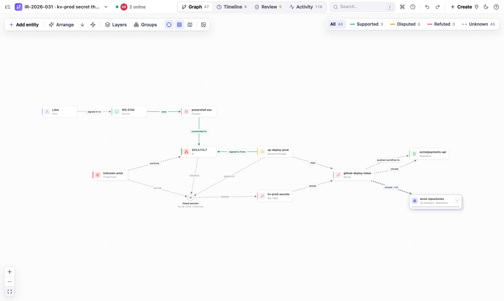
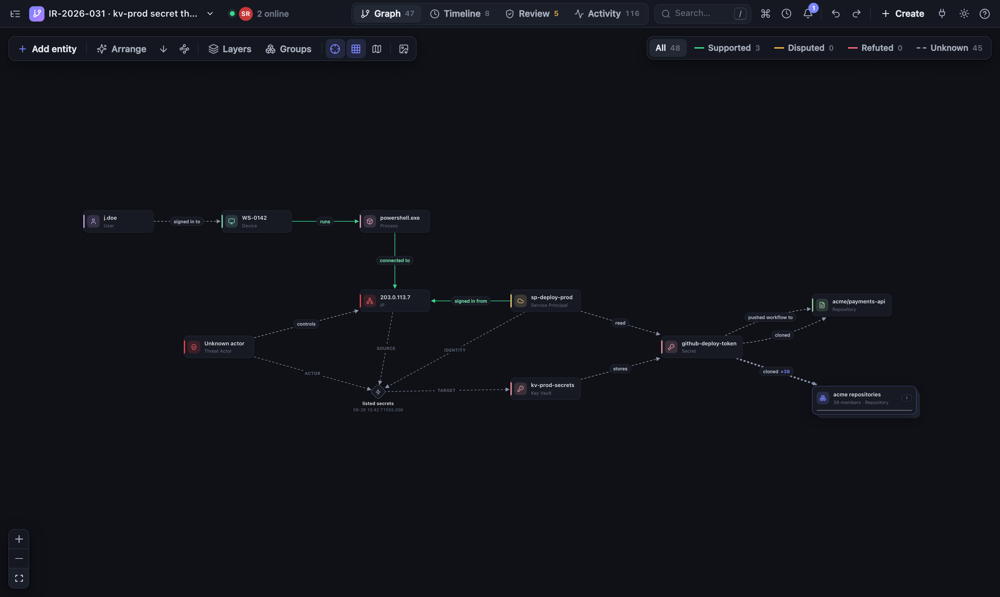
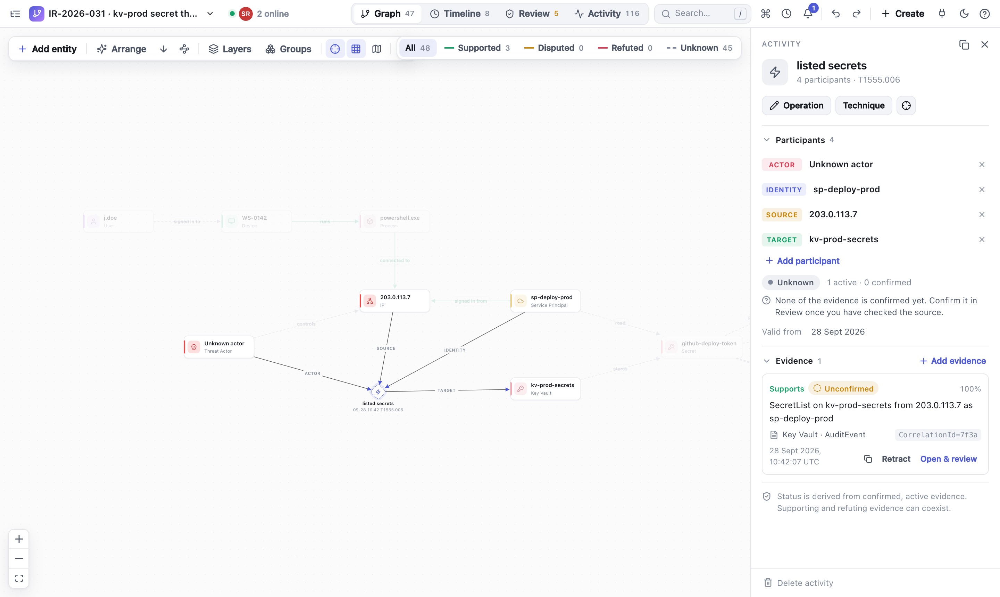
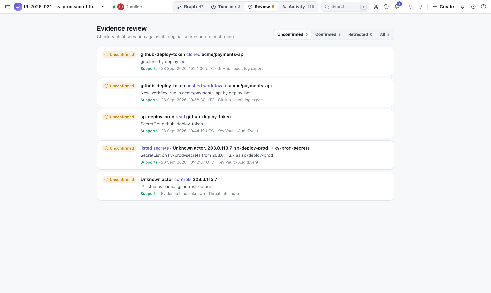
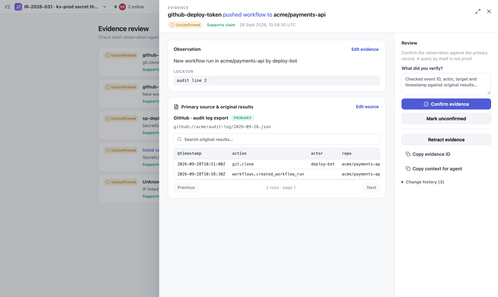
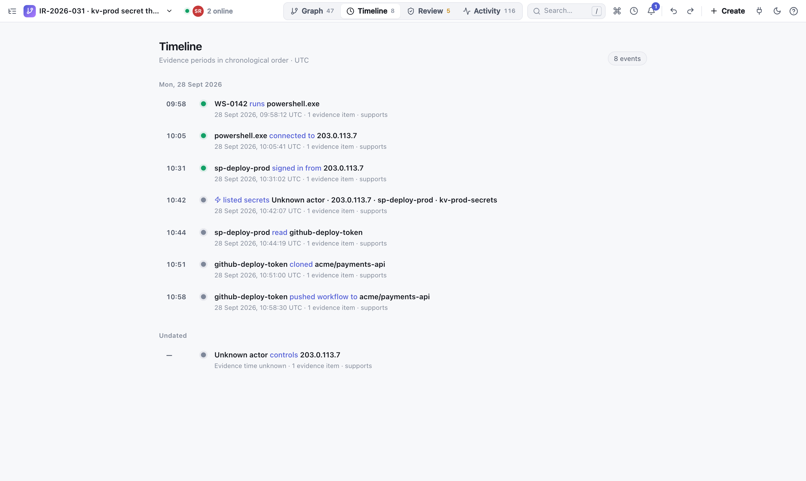
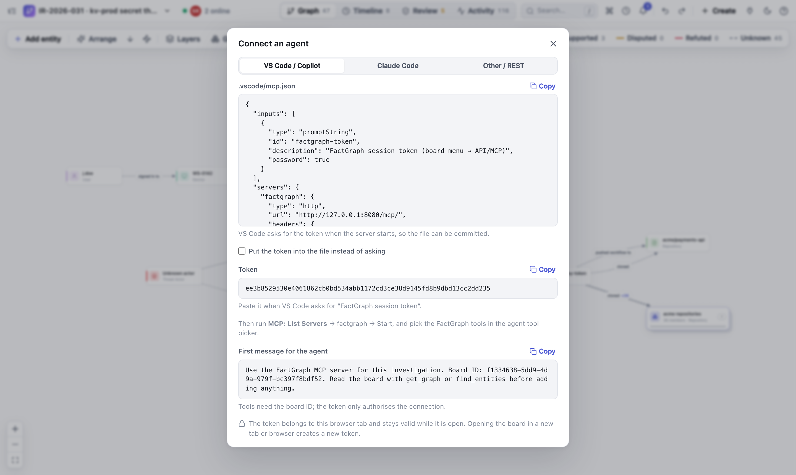

# FactGraph: collaborative, agent-native incident investigation

FactGraph is a lightweight **relay service** where analysts and **AI agents** work through larger security incidents together. The incident is modelled as a **graph**: entities (IPs, accounts, service principals, devices, key vaults, repositories …), the relationships and events between them, and for every claim the **evidence** from logs, KQL results or files. People work in the browser, agents via **MCP** or **REST**, all on the same board, synchronised live.



## Why FactGraph

Complex attacks do not show up in a single log. A foothold on an endpoint, a callback to an IP, a service principal sign-in, a secret read from a key vault and a clone of 39 repositories land in four different systems: EDR, Entra ID, Key Vault audit and GitHub. None of these sources references the others. The connection only becomes visible when you put the events side by side **as a graph and in time order**.

FactGraph is built for exactly that:

- **Link sources that are not linked.** Every source keeps its original records. FactGraph puts their entities and events into one graph, so you can trace the path across tools: the IP from the EDR beacon is the same IP that signed in as the service principal and listed the vault's secrets.
- **Follow the attack through time.** Every relationship and event carries the time span the evidence shows. The timeline and the evidence time window replay the attack step by step.
- **Keep claims and proof apart.** A line in the graph is a claim. It becomes *supported* only when someone has checked confirmed primary evidence against the original record. Hypotheses stay visible as hypotheses.
- **Ready when your own infrastructure is not.** During a large-scale compromise you cannot trust the ticket system, the wiki or the chat of the affected environment. FactGraph is a single stateless container: spin it up out-of-band in minutes (for example as an Azure Web App in a separate, clean subscription), use it with minimal resources, and delete it afterwards. There is no database to provision, secure or wipe.
- **Agent-native.** Attackers already use AI to move faster. Defenders need tools that AI can accelerate too. In FactGraph, agents are first-class: they query logs, add entities, relationships and evidence through MCP or REST, and analysts see the results immediately in the same graph, review them against the source and confirm or refute them.

The result is a shared, traceable picture of the incident instead of findings scattered across chats, tickets and spreadsheets.

## Architecture: a relay, not a database

```text
 Analyst A (browser)          Analyst B (browser)
  IndexedDB ◄──────┐          ┌──────► IndexedDB
                   │ WebSocket│
             ┌─────┴──────────┴─────┐
             │   FactGraph server   │   stores no board data
             │  relay · REST · MCP  │
             └─────┬──────────┬─────┘
                   │ REST     │ MCP
          scripts / imports   AI agent (VS Code, Claude Code …)
```

- **Board data lives only in the browsers** (IndexedDB). Every change is an action with an ID and a logical clock. All browsers that have a board open exchange these actions through the server and compute the same graph from them.
- **The server stores nothing.** It serves the UI, relays actions in real time and provides REST and MCP. There is no external database and no login.
- **REST and MCP write through an open browser.** A call is forwarded to a browser that has the board open and is answered only after that browser has stored it. If no browser has the board open, the API answers `409`.
- **Consequence:** a board exists as long as at least one browser holds it. A new device receives the data only while such a browser is connected. Clearing browser data deletes the boards, so export them regularly as JSON (board menu).

## Getting started

From Docker Hub (amd64 and arm64):

```bash
docker run --rm -p 8080:8080 k3mpaxl/factgraph:latest
```

With Docker Compose from the repository:

```bash
docker compose -f deploy/compose.yaml up --build
```

Directly with Python 3.11+ and Node.js 20+:

```bash
python3 -m venv .venv
.venv/bin/pip install -r requirements.txt
cd web && npm ci && npm run build && cd ..
.venv/bin/uvicorn app.main:app --host 0.0.0.0 --port 8080
```

- UI: <http://127.0.0.1:8080>
- REST documentation: <http://127.0.0.1:8080/docs>
- MCP endpoint: `http://127.0.0.1:8080/mcp/` (Streamable HTTP)

Every board URL contains a UUID (`/boards/<uuid>`). The **board menu** (top left) copies the link, creates new boards and lists the boards stored in this browser. Colleagues on the same network open `http://<server-ip>:8080/boards/<uuid>`. Compose binds to `127.0.0.1` by default; for the LAN:

```bash
FACTGRAPH_BIND_IP=0.0.0.0 docker compose -f deploy/compose.yaml up -d
```

> **Security:** there is no user login. Anyone who can reach the server *and* knows a board link can read and change that board. Restrict network access (see [Security by default](#security-by-default) and [Azure App Service](#deploying-on-azure-app-service)).

### Configuration

| Variable | Default | Meaning |
| --- | --- | --- |
| `FACTGRAPH_MCP_TOOLS` | `agent` | `agent` = compact MCP tool set, `full` = one `rest_*` tool per REST operation |
| `FACTGRAPH_ALLOWED_ORIGINS` | *(empty)* | Extra browser origins allowed to join the relay, comma-separated (e.g. a dev server). Pages served by FactGraph itself are always allowed. |
| `FACTGRAPH_BIND_IP` | `127.0.0.1` | Compose only: host interface the port is published on |

## Security by default

FactGraph is meant to be spun up during an incident, often in a hurry and sometimes while the regular infrastructure is compromised. The defaults are therefore as strict as possible without configuration:

**Nothing at rest on the server**
- The server keeps no board data, no history and no files, only the list of browsers currently connected. A seized or compromised server reveals no investigation content; when the incident is over, delete the container or the app.
- The server makes no outbound connections and runs no queries. The UI loads nothing from third parties.

**Access**
- The board ID in the URL is a random UUID (122 bits) and acts as the board's access key. Treat a board link like a password and share it only through a trusted channel.
- REST and MCP need the **session token** of a browser tab that has the board open. Tokens are random per tab, only valid while that tab is connected, accepted **only in the `X-FactGraph-Token` header** (never in URLs, so they do not end up in proxy or platform logs) and compared in constant time.
- The WebSocket relay accepts browsers only from pages served by FactGraph itself (Origin check against cross-site WebSocket hijacking). Identity and token are sent in the first message, not in the connection URL.

**Browser hardening (HTTP headers)**
- `Content-Security-Policy`: only the app's own scripts, styles, images and connections; no third-party content, no inline scripts (the one tiny theme script is allowed by hash), no framing (`frame-ancestors 'none'`), no plugins.
- `Referrer-Policy: no-referrer`: following a link in evidence never leaks the board URL to another site.
- `X-Frame-Options: DENY`, `X-Content-Type-Options: nosniff`, `Cross-Origin-Opener-Policy` and `Cross-Origin-Resource-Policy: same-origin`, a restrictive `Permissions-Policy`.
- `Strict-Transport-Security` when served over HTTPS (also behind a TLS-terminating proxy), `Cache-Control: no-store` for API responses.
- The Swagger UI under `/docs` loads its assets from a CDN and is therefore exempt from the CSP; it contains no board data.

**Container**
- Runs as an unprivileged user (UID 10001) on a slim Python image.
- No access log (request URLs contain board IDs) and no server banner.
- Single port 8080, plain HTTP; TLS is terminated in front (Azure App Service, Caddy, nginx, Traefik, an ingress). The browser automatically uses `wss://` for the relay when the page is served over HTTPS.

**What it does not do**
- There is no user authentication. Anyone with network access and a board link has full access to that board, so restrict network access to the response team.
- Board data lives in the analysts' browsers (IndexedDB). Use trusted devices, and remember that exported JSON files contain the full investigation.
- A session token proves that a browser tab has the board open, not that a human reviewed something. Technically enforced human approval would require separate permissions.

## Deploying on Azure App Service

Azure App Service takes care of the certificate and TLS, scales down to a small plan and can be restricted to the responders' IP addresses. For a compromised environment, deploy into a **separate, clean subscription or tenant**, not into the affected one.

```bash
RG=rg-factgraph
APP=factgraph-ir-$RANDOM            # becomes https://$APP.azurewebsites.net
az group create -n $RG -l westeurope
az appservice plan create -g $RG -n plan-factgraph --is-linux --sku B1
az webapp create -g $RG -p plan-factgraph -n $APP --container-image-name docker.io/k3mpaxl/factgraph:latest
az webapp config appsettings set -g $RG -n $APP --settings WEBSITES_PORT=8080
az webapp config set -g $RG -n $APP --web-sockets-enabled true --always-on true \
  --min-tls-version 1.2 --ftps-state Disabled --http20-enabled true
az webapp update -g $RG -n $APP --https-only true
```

Restrict access to the response team (adding an allow rule denies everything else):

```bash
az webapp config access-restriction add -g $RG -n $APP --rule-name responders \
  --action Allow --ip-address 198.51.100.0/24 --priority 100
```

Notes:

- **Exactly one instance.** The relay keeps the list of connected browsers in memory; with several instances, analysts on different instances would not see each other. Do not scale out.
- **Web sockets must be on**, otherwise the board stays offline. **Always On** prevents the app from idling and dropping connections.
- Prefer a pinned version (`k3mpaxl/factgraph:0.4.9`) over `latest` during an incident, so a restart never changes the version.
- App Service **HTTP logging** is off by default. If you enable it, it records request URLs, which contain board IDs.
- **App Service Authentication** (Entra ID sign-in) can be put in front of the UI. Agents and scripts then also need an Entra token, and if the incident involves your own tenant, an identity provider you cannot trust is no protection. IP access restrictions are often the better choice there.
- When the incident is closed: export the boards as JSON, then `az group delete -n $RG`. Nothing remains on the server side.

## Working in the graph

### Interface

- A slim header with the board menu, the views (**Graph**, **Timeline**, **Review**, **Activity**), search, undo/redo, **Create** and the API/MCP menu. On the left the collapsible **entity explorer** (grouped by type), on the right the **inspector**, which appears only when something is selected.
- The header shows **who is online**: avatars of everyone connected to the board. A click lists them, together with recent authors who are no longer connected, such as agents writing via REST or MCP.
- Light mode is the default; the moon icon switches to dark mode and the choice is remembered.
- On the first visit FactGraph asks for a display name, which other analysts see in the presence list and in the history.
- The **?** (top right) explains where data is stored, shows the storage used, can ask the browser for persistent storage, offers the JSON export and shows the app and server versions. The second tab lists all keyboard shortcuts.



### Entities, relationships, evidence

- Add an entity: **Add entity** (pick a type or drag it onto the canvas), double-click on empty canvas, or press `N`.
- Connect: drag the right-hand handle of a node onto another node, or onto empty canvas to create the target and the relationship in one step.
- Double-click a title to rename it. Right-click offers type and color, merge, copy ID, pin, delete, collapse contents and taking an entity out of its group.
- **Colors:** the color picker offers default swatches plus the colors already used on the board, so related infrastructure (for example all C2 servers) gets the same color in one click.
- The inspector shows relationships, identifiers and evidence and navigates to neighbours on click. **Copy context for agent** copies IDs and context for an agent chat.
- Long edge labels are shortened; hovering or selecting an edge shows the full label.

### Large graphs

- **Focus:** a selection highlights its direct neighbours and fades the rest.
- **Jump:** `Cmd/Ctrl+K` opens the command palette; picking a result selects it and zooms to it with its neighbours.
- **Level of detail:** labels and node details appear as you zoom in. Edges attach to the node border; parallel relationships are curved.
- **Minimap** appears automatically from 60 nodes.
- **Arrange:** up to 150 nodes as a directed flow (left → right, or ↓ for top → bottom), above that **organic** (force layout: connected nodes form clusters, cards never overlap; also available directly via the node icon). 1,100 nodes take about two seconds. Pinned nodes keep their position.
- **Status filter** and **evidence time window** (`T`) filter edges by review status and time span; the time window can be played back step by step.

### Mouse, trackpad, keyboard

| Input | Action |
| --- | --- |
| Mouse wheel, trackpad pinch | Zoom |
| Right mouse button drag, two-finger trackpad swipe, `Space` + drag | Pan |
| `Shift` + mouse wheel | Pan sideways |
| Left mouse button drag on empty canvas | Box select |
| `Cmd/Ctrl+K` | Command palette / find entity |
| `/` | Focus search |
| `N` | New entity |
| `F` | Fit graph or centre the selection |
| `G` | Group selection |
| `1`–`4` | Switch view |
| `E` / `T` | Explorer / time window |
| `Cmd/Ctrl+Z`, `Shift+Cmd/Ctrl+Z` | Undo / redo |
| `Delete` | Delete selection |
| `?` | Help and shortcuts |

## Activities, layers and groups

### Events with several participants

"The attacker uses IP a.a.a.a and service principal B and lists key vault C" is **one** event, not three edges. An **activity** has an operation (`listed secrets`), optionally a MITRE ATT&CK technique, a time span and participants with roles:

| Role | Meaning |
| --- | --- |
| `actor` | who acts (attacker, user) |
| `identity` | the identity used (account, service principal) |
| `source` | where it came from (IP, device) |
| `tool` | tool or process |
| `via` | intermediate system |
| `target` | what was acted upon |
| `other` | other participants |

Evidence is attached to the whole event; review, status, timeline and time window work just like for relationships. On the canvas an activity is a diamond with labelled spokes; under **Layers** it can also be shown as a simple edge. The attribution "this IP belongs to the attacker" is a separate relationship with its own evidence.



### Layers and perspectives

Every type belongs to a layer: **Identity & access**, **Network**, **Endpoint**, **Workload** (Kubernetes, containers), **Cloud control plane** (subscriptions, key vaults), **Data & storage** (buckets, blobs, databases), **Code & CI**, **Other**. The layer is derived from the type and can be overridden per type or per entity.

**Layers** shows and hides layers (a badge on a node counts connections into hidden layers), draws swimlanes and arranges **by layer**. Combinations can be saved as a **perspective**, are synchronised with the board and can be linked with `?lens=<id>`.

**Collapse contents:** if a device or cluster has `contains`, `runs` or `hosts` relationships, the context menu entry **Collapse contents** folds everything it contains into the node ("12 inside").

### Groups

A group bundles many entities into one node, for example 699 of 700 repositories where the same thing happened. Members are explicit (multi-select, `G`) or rule-based (type and/or text pattern); new matching entities join automatically. **Take out** keeps individual entities visible outside the group, typically exactly the ones where something different happened. Edges to the group are bundled and counted (`cloned ×38`). **Groups** in the canvas toolbar suggests groups from entities of the same type with identical connections and names the outliers.

Collapsed and expanded groups share one place: drag the collapsed card and the members appear there when you expand it; drag an expanded group by its frame header and all members move along. Groups and perspectives change only the view, never claims or evidence.

## Evidence and review

- A **source** describes where something comes from: title, reference (log export, `path@commit`, portal link), the original records as an excerpt and, for queries, the KQL. `primary` sources are original logs, telemetry and files; `secondary` is context and never proof. **FactGraph does not run queries**; the query and the results it returned are stored together as provenance.
- An **evidence item** holds the observation, the locator (event ID, CorrelationId, result row, file:line), the time span of the activity, the stance (`supports`/`refutes`) and a confidence.
- New evidence is **unconfirmed**. Confirming requires a primary source with reference and original excerpt, a concrete locator, an observation and a review note, and is bound to the current revision. If the evidence, the claim or the source changes, the confirmation is reset.
- The status of a relationship is derived only from active, confirmed evidence: **Supported**, **Refuted**, **Disputed** (both) or **Unknown**. Retracted evidence stays in the history.
- Relationships with confirmed evidence cannot be reconnected by dragging ("ends locked"); renaming asks for confirmation first.
- **Review** lists open evidence. The evidence reader shows the observation, the source, the original results as a searchable table, the query and the history, and lets you edit, confirm, retract and restore.
- The **timeline** shows active evidence chronologically in UTC. `valid_from`/`valid_to` describe when the activity happened, not when it was recorded; unknown times are listed at the end.







## Connecting AI agents (MCP and REST)

When a board is opened, the browser creates a random **session token**. REST and MCP expect it in the `X-FactGraph-Token` header (MCP also accepts the `session_token` parameter). The token binds calls to this browser tab; it is not a user account. A new tab or browser creates a new token.

**Connect an agent** (API/MCP menu or command palette) provides ready-to-copy snippets:

- `.vscode/mcp.json` for VS Code / GitHub Copilot. By default VS Code asks for the token when the server starts, so the file can be committed; optionally with the token embedded.
- The command for Claude Code (`claude mcp add --transport http factgraph … --header "X-FactGraph-Token: …"`).
- Endpoint and header for other clients.
- A first message for the agent containing the board ID.



The repository also contains [.vscode/mcp.json](.vscode/mcp.json); in VS Code run **MCP: List Servers** → `factgraph` → Start. From another device, replace `127.0.0.1` with the server's IP.

### MCP tools

By default the server exposes a **compact agent profile with 24 tools** (about 9,000 tokens of tool descriptions). Fewer tools mean less context usage and better tool choice.

| Task | MCP tool | REST (relative to `/api/boards/{id}`) |
| --- | --- | --- |
| Read the graph, find entities | `get_graph`, `find_entities` | `GET /graph`, `GET /entities?q=` |
| Entities | `create_entity`, `update_entity`, `merge_entities`, `delete_entity`, `add_identifier` | `/entities…` |
| Relationships | `create_relation`, `update_relation`, `delete_relation` | `/relations…` |
| Activities | `create_activity`, `update_activity` | `/activities…` |
| Sources and evidence | `create_source`, `update_source`, `add_evidence`, `update_evidence`, `review_evidence`, `retract_evidence` | `/sources…`, `/relations/{id}/evidence…` |
| Imports | `import_rows`, `import_activities` | `/imports/activity`, `/imports/kql`, `/imports/activities` |
| Overview and export | `create_group`, `update_group`, `export_image` | `/groups…`, `/export` |
| Undo | `undo` | `/undo` |

The REST API stays complete (types, perspectives, single-item reads, history, redo, raw actions …). With `FACTGRAPH_MCP_TOOLS=full` the MCP server instead exposes one `rest_<operation>` tool per REST operation, with identical parameters and validation:

```bash
docker run -e FACTGRAPH_MCP_TOOLS=full -p 8080:8080 k3mpaxl/factgraph:latest
```

On connect the server sends binding **working rules** to the agent (also available via `GET /api/guidelines`): read first and reuse existing IDs; concrete entities; specific verbs; an activity for three or more participants; primary evidence for every important claim; keep uncertainty and contradictions; run imports as `dry_run` first. Agents may confirm evidence, but only after checking the original record and with a review note.

### REST examples

```bash
TOKEN=...   # from "Connect an agent" or "Copy session token"
BOARD=...   # board UUID

curl -X POST "http://127.0.0.1:8080/api/boards/$BOARD/entities" \
  -H "X-FactGraph-Token: $TOKEN" -H 'Content-Type: application/json' \
  -d '{"name":"203.0.113.7","kind":"IP"}'

curl -X POST "http://127.0.0.1:8080/api/boards/$BOARD/activities" \
  -H "X-FactGraph-Token: $TOKEN" -H 'Content-Type: application/json' \
  -d '{"operation":"listed secrets","participants":[
        {"entity_id":"ACTOR_ID","role":"actor"},{"entity_id":"IP_ID","role":"source"},
        {"entity_id":"SP_ID","role":"identity"},{"entity_id":"KV_ID","role":"target"}],
       "valid_from":"2026-09-28T10:42:07Z","source_id":"SOURCE_ID",
       "observation":"SecretList from 203.0.113.7 as sp-deploy-prod","locator":"CorrelationId=7f3a"}'
```

Python with FastMCP:

```python
from fastmcp import Client

async with Client("http://127.0.0.1:8080/mcp/") as client:
    result = await client.call_tool("create_entity", {
        "board_id": "BOARD_UUID", "session_token": "TOKEN",
        "body": {"name": "Azure credential", "kind": "Credential"},
    })
    print(result.data)
```

PATCH-style calls change only the fields they contain; an explicit `null` clears a field. Sources and evidence accept `expected_revision`; on a concurrent change the API answers `409`. For bulk work there is `POST /actions` (up to 50,000 actions; your own action IDs make retries idempotent) and the import endpoints. There is deliberately no endpoint that lists all boards.

## Importing logs and KQL results

**Import logs / KQL** (board menu) accepts CSV, JSON arrays or JSONL up to 20 MB and 50,000 rows, always with a preview first:

- **Relationships · 2 columns:** a source and a target column (for example `IPAddress → accessed → FilePath`); common column names are detected.
- **Activities · several roles:** several columns with roles, for example `CallerIPAddress → source → IP`, `AppId → identity → Service Principal`, `ResourceId → target → Key Vault`, with a fixed operation or one taken from a column (`OperationName`).

Every row becomes its own unconfirmed evidence item with its timestamp (`TimeGenerated`, `timestamp`, `StartTime`/`EndTime` …). The same operation with the same participants becomes one shared activity. Existing entities are reused; importing the same rows again creates no duplicates. For scripts: `POST /imports/file` (multipart), `/imports/activity`, `/imports/kql` and `/imports/activities`, each with `dry_run`.

```json
{
  "title": "Key Vault AuditEvent 2026-09-28",
  "query": "AzureDiagnostics | where OperationName startswith \"Secret\"",
  "rows": [{"CallerIPAddress": "203.0.113.7", "AppId": "sp-deploy-prod", "ResourceId": "kv-prod-secrets",
            "OperationName": "SecretList", "TimeGenerated": "2026-09-28T10:42:07Z"}],
  "roles": [{"field": "CallerIPAddress", "role": "source", "kind": "IP"},
            {"field": "AppId", "role": "identity", "kind": "Service Principal"},
            {"field": "ResourceId", "role": "target", "kind": "Key Vault"}],
  "operation_field": "OperationName",
  "dry_run": true
}
```

## Export as PNG or SVG

**Export image** (image icon in the canvas toolbar, board menu or command palette) exports the graph as it is currently shown, with filters, layers, groups and activities:

- **SVG** as a standalone vector file; text stays editable in Illustrator, Inkscape, Word or PowerPoint.
- **PNG** at 1×, 2× or 3×; very large graphs are reduced automatically to the browser's size limits.
- Scope: the whole graph, the visible area or the selection; light or dark theme, transparent background, title with filters and date, status legend. **Copy** puts the image on the clipboard.
- Agents use `export_image` or `POST /export`; the response contains `content` as SVG text or base64 PNG:

```bash
curl -s -X POST "http://127.0.0.1:8080/api/boards/$BOARD/export" \
  -H "X-FactGraph-Token: $TOKEN" -H 'Content-Type: application/json' \
  -d '{"format":"png","theme":"light","scale":2}' | jq -r .content | base64 -d > graph.png
```

## Synchronisation, conflicts and limits

- Every browser sorts all actions the same way (logical clock, actor, ID). Any arrival order therefore produces the same graph, and concurrent changes to the same field are resolved identically everywhere.
- When joining and reconnecting, browsers exchange their histories. Changes made offline stay local and are delivered later.
- If an entity is merged while another browser still works with the old ID, that browser's new relationships, activity roles, identifiers and group changes end up on the merge target instead of being lost.
- Group membership changes are incremental, so concurrent edits by two analysts are both kept.
- **Undo** (`Cmd/Ctrl+Z`) reverts your own last group of actions (an import counts as one group) and refuses if someone else has changed the same records in the meantime. The **Activity** view lists all actions with channel (UI, REST, MCP), author and time.
- If no browser has the board open, a new device cannot restore it from the UUID alone; import a JSON export instead. Without an export, boards are lost when the browser data is cleared.

## Development and tests

```bash
.venv/bin/python -m unittest discover -s tests -v   # backend, REST/MCP contracts, relay
cd web
npm ci
npm test                                           # projection, review, convergence, export, layout, wheel
npx playwright install chromium
npm run test:e2e                                   # browser workflows against a real server
```

The browser tests run on temporary boards on port 18088 with a real MCP client. Among other things they cover analyst and agent review, offline sync with a concurrent merge in two browsers, activities, groups (including moving collapsed and expanded groups), layers, presence, export, mouse and trackpad navigation, the mobile layout, imports with preview and deduplication, and 10,000 imported evidence items.

The screenshots in this README are generated from a scripted incident:

```bash
cd web && npm run build && DOCS_SCREENSHOTS=1 npx playwright test e2e/docs-screenshots.spec.ts
```

## Releases (GitHub and Docker Hub)

- **CI** runs all tests on every push and builds the Docker image.
- **Publish Docker image** builds the image for `linux/amd64` and `linux/arm64` on a version tag (`v*.*.*`) or via **Run workflow**, and publishes it as `latest` and with the version number. It requires the repository secrets `DOCKERHUB_USERNAME` and `DOCKERHUB_TOKEN` (a Docker Hub access token with write permission).

```bash
git tag v0.4.9
git push origin v0.4.9
```

A manual multi-arch build is possible with `./deploy/publish-multiarch.sh` (`FACTGRAPH_IMAGE` and `FACTGRAPH_VERSION` override namespace and version).
