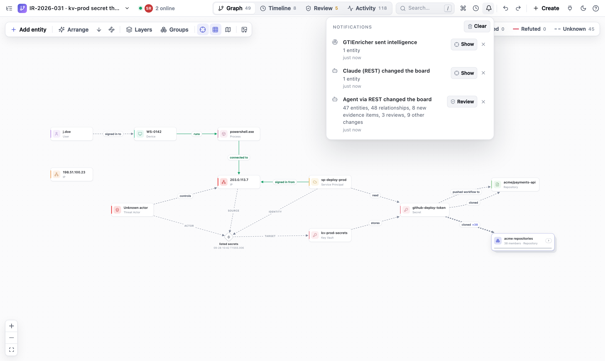

# FactGraph: collaborative, agent-native incident investigation

FactGraph is a lightweight **relay service** where analysts and **AI agents** work through larger security incidents together. The incident is modelled as a **graph**: entities (IPs, accounts, service principals, devices, key vaults, repositories …), the relationships and events between them, and for every claim the **evidence** from logs, KQL results or files. People work in the browser, agents via **MCP** or **REST**, all on the same board, synchronised live.


## Why FactGraph

Complex attacks do not show up in a single log. A foothold on an endpoint, a callback to an IP, a service principal sign-in, a secret read from a key vault and a clone of 39 repositories land in four different systems: EDR, Entra ID, Key Vault audit and GitHub. None of these sources references the others. The connection only becomes visible when you put the events side by side **as a graph and in time order**.

FactGraph is built for exactly that:

- **Link sources that are not linked.** Every source keeps its original records. FactGraph puts their entities and events into one graph, so you can trace the path across tools: the IP from the EDR beacon is the same IP that signed in as the service principal and listed the vault's secrets.
- **Follow the attack through time.** Every relationship and event carries the time span the evidence shows. The timeline and the evidence time window replay the attack step by step.
- **Keep claims and proof apart.** A line in the graph is a claim. It becomes *supported* only when someone has checked confirmed primary evidence against the original record. Hypotheses stay visible as hypotheses.
- **Ready when your own infrastructure is not.** During a large-scale compromise you cannot trust the ticket system, the wiki or the chat of the affected environment. FactGraph is a single stateless container: spin it up out-of-band in minutes (for example as an Azure Web App in a separate, clean subscription), use it with minimal resources, and delete it afterwards. There is no database to provision, secure or wipe.
- **Agent-native.** Attackers already use AI to move faster. Defenders need tools that AI can accelerate too. In FactGraph, agents are first-class: they query logs, add entities, relationships and evidence through MCP or REST, and analysts see the results immediately in the same graph, review them against the source and confirm or refute them.

The result is a shared, traceable picture of the incident instead of findings scattered across chats, tickets and spreadsheets.

## Architecture: a relay, not a database

```text
 Analyst A (browser)          Analyst B (browser)
  IndexedDB ◄──────┐          ┌──────► IndexedDB
                   │ WebSocket│
             ┌─────┴──────────┴─────┐
             │   FactGraph server   │   stores no board data
             │  relay · REST · MCP  │
             └─────┬──────────┬─────┘
                   │ REST     │ MCP
          scripts / imports   AI agent (VS Code, Claude Code …)
```

- **Board data lives only in the browsers** (IndexedDB). Every change is an action with an ID and a logical clock. All browsers that have a board open exchange these actions through the server and compute the same graph from them.
- **The server stores nothing.** It serves the UI, relays actions in real time and provides REST and MCP. There is no external database and no login.
- **REST and MCP write through an open browser.** A call is forwarded to a browser that has the board open and is answered only after that browser has stored it. If no browser has the board open, the API answers `409`.
- **Consequence:** a board exists as long as at least one browser holds it. A new device receives the data only while such a browser is connected. Clearing browser data deletes the boards, so export them regularly as JSON (board menu).

## Getting started

From Docker Hub (amd64 and arm64):

```bash
docker run --rm -p 8080:8080 k3mpaxl/factgraph:latest
```

With Docker Compose from the repository:

```bash
docker compose -f deploy/compose.yaml up --build
```

Directly with Python 3.11+ (the Docker image and CI use 3.14) and Node.js 20+:

```bash
python3 -m venv .venv
.venv/bin/pip install --require-hashes -r requirements.lock
cd web && npm ci && npm run build && cd ..
.venv/bin/uvicorn app.main:app --host 0.0.0.0 --port 8080
```

- UI: <http://127.0.0.1:8080>
- REST documentation: <http://127.0.0.1:8080/docs>
- MCP endpoint: `http://127.0.0.1:8080/mcp/` (Streamable HTTP)

Every board URL contains a UUID (`/boards/<uuid>`). The **board menu** (top left) copies the link, creates new boards and lists the boards stored in this browser. Colleagues on the same network open `http://<server-ip>:8080/boards/<uuid>`. Compose binds to `127.0.0.1` by default; for the LAN:

```bash
FACTGRAPH_BIND_IP=0.0.0.0 docker compose -f deploy/compose.yaml up -d
```

> **Security:** there is no user login. Anyone who can reach the server *and* knows a board link can read and change that board. Restrict network access (see [Security by default](#security-by-default) and [Azure App Service](#deploying-on-azure-app-service)).

### Configuration

| Variable | Default | Meaning |
| --- | --- | --- |
| `FACTGRAPH_MCP_TOOLS` | `agent` | `agent` = compact MCP tool set, `full` = one `rest_*` tool per REST operation |
| `FACTGRAPH_ALLOWED_ORIGINS` | *(empty)* | Extra browser origins allowed to join the relay, comma-separated (e.g. a dev server). Pages served by FactGraph itself are always allowed. |
| `FACTGRAPH_BIND_IP` | `127.0.0.1` | Compose only: host interface the port is published on |

## Security by default

FactGraph is meant to be spun up during an incident, often in a hurry and sometimes while the regular infrastructure is compromised. The defaults are therefore as strict as possible without configuration:

**Nothing at rest on the server**
- The server keeps no board data, no history and no files, only the list of browsers currently connected. A seized or compromised server reveals no investigation content; when the incident is over, delete the container or the app.
- The server makes no outbound connections and runs no queries. The UI loads nothing from third parties.

**Access**
- The board ID in the URL is a random UUID (122 bits) and acts as the board's access key. Treat a board link like a password and share it only through a trusted channel.
- REST and MCP need the **board token** of a browser tab that has the board open. Tokens are random per tab and board, only valid while that tab is connected, accepted **only in the `X-FactGraph-Token` header** (never in URLs, so they do not end up in proxy or platform logs) and compared in constant time.
- The WebSocket relay accepts browsers only from pages served by FactGraph itself (Origin check against cross-site WebSocket hijacking). Identity and token are sent in the first message, not in the connection URL.

**Browser hardening (HTTP headers)**
- `Content-Security-Policy`: only the app's own scripts, styles, images and connections; no third-party content, no inline scripts (the one tiny theme script is allowed by hash), no framing (`frame-ancestors 'none'`), no plugins.
- `Referrer-Policy: no-referrer`: following a link in evidence never leaks the board URL to another site.
- `X-Frame-Options: DENY`, `X-Content-Type-Options: nosniff`, `Cross-Origin-Opener-Policy` and `Cross-Origin-Resource-Policy: same-origin`, a restrictive `Permissions-Policy`.
- `Strict-Transport-Security` when served over HTTPS (also behind a TLS-terminating proxy), `Cache-Control: no-store` for API responses.
- The Swagger UI under `/docs` loads its assets from a CDN and is therefore exempt from the CSP; it contains no board data.

**Container**
- Runs as an unprivileged user (UID 10001) on a slim Python image.
- No access log (request URLs contain board IDs) and no server banner.
- Single port 8080, plain HTTP; TLS is terminated in front (Azure App Service, Caddy, nginx, Traefik, an ingress). The browser automatically uses `wss://` for the relay when the page is served over HTTPS.

**What it does not do**
- There is no user authentication. Anyone with network access and a board link has full access to that board, so restrict network access to the response team.
- Board data lives in the analysts' browsers (IndexedDB). Use trusted devices, and remember that exported JSON files contain the full investigation.
- A board token proves that a browser tab has the board open, not that a human reviewed something. Technically enforced human approval would require separate permissions.
- Provenance labels (*parsed by the import*, *reviewed by …*, *confirmed by an agent*, who marked a compromise) are recorded by the browsers, not signed. Anyone with the board link can connect to the relay and write actions with any author or channel, so treat these labels as reliable within a trusted team, not as proof against a hostile participant. The relay operator can also see board content in transit (it stores none).
- Agents share the tab's board token, and their changes are recorded as that analyst's agent ("MCP (Gregor)"). Only the tab that started a file upload treats its rows as the analyst's own import; the same upload by anything else (an agent, a script) is handled like any other REST write, so its evidence starts unconfirmed.
- **Remove board from this browser** (board menu) deletes a board's data from this browser's storage; colleagues keep their copies.

## Deploying on Azure App Service

Azure App Service takes care of the certificate and TLS, scales down to a small plan and can be restricted to the responders' IP addresses. For a compromised environment, deploy into a **separate, clean subscription or tenant**, not into the affected one.

```bash
RG=rg-factgraph
APP=factgraph-ir-$RANDOM            # becomes https://$APP.azurewebsites.net
az group create -n $RG -l westeurope
az appservice plan create -g $RG -n plan-factgraph --is-linux --sku B1
az webapp create -g $RG -p plan-factgraph -n $APP --container-image-name docker.io/k3mpaxl/factgraph:latest
az webapp config appsettings set -g $RG -n $APP --settings WEBSITES_PORT=8080
az webapp config set -g $RG -n $APP --web-sockets-enabled true --always-on true \
  --min-tls-version 1.2 --ftps-state Disabled --http20-enabled true
az webapp update -g $RG -n $APP --https-only true
```

Restrict access to the response team (adding an allow rule denies everything else):

```bash
az webapp config access-restriction add -g $RG -n $APP --rule-name responders \
  --action Allow --ip-address 198.51.100.0/24 --priority 100
```

Notes:

- **Exactly one instance.** The relay keeps the list of connected browsers in memory; with several instances, analysts on different instances would not see each other. Do not scale out.
- **Web sockets must be on**, otherwise the board stays offline. **Always On** prevents the app from idling and dropping connections.
- Prefer a pinned version (`k3mpaxl/factgraph:0.5.2`) over `latest` during an incident, so a restart never changes the version.
- App Service **HTTP logging** is off by default. If you enable it, it records request URLs, which contain board IDs.
- **App Service Authentication** (Entra ID sign-in) can be put in front of the UI. Agents and scripts then also need an Entra token, and if the incident involves your own tenant, an identity provider you cannot trust is no protection. IP access restrictions are often the better choice there.
- When the incident is closed: export the boards as JSON, then `az group delete -n $RG`. Nothing remains on the server side.

## Working in the graph

### Interface

- A slim header with the board menu, the views (**Graph**, **Timeline**, **Review**, **Change log**, **Impact**, keys `1`–`5`), *Find entity*, undo/redo, **Create** and the API/MCP menu. On the left the collapsible **entity explorer** (grouped by type), on the right the **inspector**, which appears only when something is selected.
- The header shows **who is online**: avatars of everyone connected to the board. A click lists them, together with recent authors who are no longer connected, such as agents writing via REST or MCP.
- Light mode is the default; the moon icon switches to dark mode and the choice is remembered.
- On the first visit FactGraph asks for a display name, which other analysts see in the presence list and in the history.
- The **?** (top right) explains where data is stored, shows the storage used, can ask the browser for persistent storage, offers the JSON export and shows the app and server versions. The second tab lists all keyboard shortcuts, the third is a **glossary** of statuses, review, stance, confidence, layers and the other terms.
- The **bell** collects what happened on the board: changes by agents (REST/MCP; the calls of one agent within two minutes become one entry), intelligence sent by Enricher (formerly GTIEnricher), colleagues' changes (listed, but they do not raise the badge), your own imports and exports with progress and result, and connection or storage problems. Each entry leads to the review, the item or the change log. The badge turns red on errors; the history is kept per board in this browser.
- **Your view stays yours:** status filter, evidence window, layers, selection and zoom are remembered per board in this browser and restored on reload. They are never synced, so colleagues keep their own view. Board menu → **Reset my view** clears them. A shared perspective link still takes precedence.




### Entities, relationships, evidence

- Add an entity: **Add entity** (pick a type or drag it onto the canvas), double-click on empty canvas, or press `N`.
- Connect: drag the right-hand handle of a node onto another node, or onto empty canvas to create the target and the relationship in one step.
- Double-click a title to rename it. Right-click offers type and color, merge, copy ID, pin, delete, collapse contents and taking an entity out of its group.
- **Colors:** the color picker offers default swatches plus the colors already used on the board, so related infrastructure (for example all C2 servers) gets the same color in one click.
- The inspector shows relationships, identifiers and evidence and navigates to neighbours on click. **Copy context for agent** copies IDs and context for an agent chat.
- Long edge labels are shortened; hovering or selecting an edge shows the full label.
- Dialogs pick entities by search (name, type, identifier or ID) and show what each belongs to (repository, host, subscription) and its identifiers, so two `.env` files in different repositories are told apart; same-named entities are flagged.
- **Merge** shows a preview before saving: which entity stays and which disappears, how many identifiers and relationships move, how many confirmed evidence items need a review again, and what is dropped (type, description, a compromise marking).
- An entity can be related to itself (for example after merging two entities that were connected); the graph draws a loop.
- Times in dialogs are UTC, whatever the browser's time zone.

### Large graphs

- **Focus:** a selection highlights its direct neighbours and fades the rest.
- **Jump:** `Cmd/Ctrl+K` opens the command palette; picking a result selects it and zooms to it with its neighbours.
- **Level of detail:** labels and node details appear as you zoom in. Edges attach to the node border; parallel relationships are curved.
- **Minimap** appears automatically from 60 nodes.
- **Arrange:** up to 250 nodes as a directed flow (left → right, or ↓ for top → bottom), above that **organic** (force layout: connected nodes form clusters, cards never overlap; also available directly via the node icon). 1,100 nodes take about two seconds. Pinned nodes keep their position. For a large graph with many similar entities, **Group all similar** first: five real Sentinel and GitLab exports (8,584 rows) made 2,822 nodes, grouped 167, which the flow layout arranges readably.
- **Status filter** and **evidence time window** (`T`) filter edges by review status and time span; the time window can be played back step by step.
- **Performance:** one projection of the action log is shared by the canvas, the inspector and every REST/MCP request; evidence times are parsed once per change. A board with 12,000 actions (2,000 entities, 5,000 relationships) projects in about 15 ms, and moving the evidence window takes about 2 ms. `npm run bench` checks this on a synthetic board.

### Mouse, trackpad, keyboard

| Input | Action |
| --- | --- |
| Mouse wheel, trackpad pinch | Zoom |
| Right mouse button drag, two-finger trackpad swipe, `Space` + drag | Pan |
| `Shift` + mouse wheel | Pan sideways |
| Left mouse button drag on empty canvas | Box select |
| `Cmd/Ctrl+K` | Command palette / find entity |
| `/` | Focus search |
| `N` | New entity |
| `F` | Fit graph or centre the selection |
| `G` | Group selection |
| `1`–`4` | Switch view |
| `E` / `T` | Explorer / time window |
| `Cmd/Ctrl+Z`, `Shift+Cmd/Ctrl+Z` | Undo / redo |
| `Delete` | Delete selection |
| `?` | Help and shortcuts |

## Activities, layers and groups

### Events with several participants

"The attacker uses IP a.a.a.a and service principal B and lists key vault C" is **one** event, not three edges. An **activity** has an operation (`listed secrets`), optionally a MITRE ATT&CK technique, a time span and participants with roles:

| Role | Meaning |
| --- | --- |
| `actor` | who acts (attacker, user) |
| `identity` | the identity used (account, service principal) |
| `source` | where it came from (IP, device) |
| `tool` | tool or process |
| `via` | intermediate system |
| `target` | what was acted upon |
| `other` | other participants |

Evidence is attached to the whole event; review, status, timeline and time window work just like for relationships. On the canvas an activity is a diamond with labelled spokes; under **Layers** it can also be shown as a simple edge. The attribution "this IP belongs to the attacker" is a separate relationship with its own evidence.


### Layers and perspectives

Every type belongs to a layer: **Identity & access**, **Network**, **Endpoint**, **Workload** (Kubernetes, containers), **Cloud control plane** (subscriptions, key vaults), **Data & storage** (buckets, blobs, databases), **Code & CI**, **Other**. The layer is derived from the type and can be overridden per type or per entity.

**Layers** shows and hides layers (a badge on a node counts connections into hidden layers), draws swimlanes and arranges **by layer**. Combinations can be saved as a **perspective**, are synchronised with the board and can be linked with `?lens=<id>`.

**Collapse contents:** if a device or cluster has `contains`, `runs` or `hosts` relationships, the context menu entry **Collapse contents** folds everything it contains into the node ("12 inside").

### Groups

A group bundles many entities into one node, for example 699 of 700 repositories where the same thing happened. Members are explicit (multi-select, `G`) or rule-based (type and/or text pattern); new matching entities join automatically. **Take out** keeps individual entities visible outside the group, typically exactly the ones where something different happened. Edges to the group are bundled and counted (`cloned ×38`). **Groups** in the canvas toolbar suggests groups from entities of the same type with identical connections and names the outliers.

**Group all similar** (Groups popover or command palette) does this for the whole board in one step (one undo): first entities of one type with the same operations and the same counterparts in the same roles (`41 Azure Resource · write cognitiveservices/accounts/deployments`), then the rest of one type that share their counterparts with different operations, then those with the same operations and the same *shared* counterparts, each with partners of its own (89 files one user read from one IP, each in its own repository; a counterpart is shared when it takes part in at least four activities, and every group needs one). At least four per group; pinned and already grouped entities stay as they are, and so does the one that differs. The groups are collapsed and the smaller graph is arranged. Dropped exports do the same for the entities they add: a hub-and-spoke export such as AzureActivity (one service principal, one IP, hundreds of resources) arrives as a few groups instead of a fan of hundreds of nodes. Activities with the same operation between the same nodes are then drawn as one diamond with a count and the time span (`delete ×12`); expand the group to see them one by one.

Collapsed and expanded groups share one place: drag the collapsed card and the members appear there when you expand it; drag an expanded group by its frame header and all members move along. Members that were scattered (collected by **Group all similar** or an import from all over the board) are laid out as a grid sorted by name right next to the card, growing away from the middle of the graph so the neighbouring cards stay visible; members you arranged yourself keep their arrangement. Activities that were drawn as one while the group was collapsed are placed between their participants again. Groups and perspectives change only the view, never claims or evidence.

## Evidence and review

Evidence your own file import parsed from a log row is confirmed right away as **parsed by the import**: the row is the original record, but nobody has read it. Evidence written by hand, sent by an agent through REST or MCP (including rows an agent imports, since it could have written them itself) or edited later starts unconfirmed and is checked in **Review** (attacker activity first, one card per activity). Review keeps the kinds apart: *To review*, *Agent-confirmed*, *Parsed by import* and *Reviewed* (by an analyst), so an empty queue is not mistaken for "everything checked". Each item says who added it and through which channel. In the reader, *Previous / Next* and *All items* step through every item of an activity (one card can stand for thousands of rows), *Confirm this item only* confirms exactly one, and the item's own row reads top to bottom with the key fields first and the column the event time came from. Changing the evidence or its source asks for a review again; the source editor says how many items that affects.

- A **source** describes where something comes from: title, reference (log export, `path@commit`, portal link), the original records as an excerpt and, for queries, the KQL. `primary` sources are original logs, telemetry and files; `secondary` is context and never proof. **FactGraph does not run queries**; the query and the results it returned are stored together as provenance.
- An **evidence item** holds the observation, the locator (event ID, CorrelationId, result row, file:line), the time span of the activity, the stance (`supports`/`refutes`) and a confidence.
- New evidence is **unconfirmed**. Confirming requires a primary source with reference and original excerpt, a concrete locator, an observation and a review note, and is bound to the current revision. If the evidence, the claim or the source changes, the confirmation is reset.
- The status of a relationship is derived only from active, confirmed evidence: **Supported**, **Refuted**, **Disputed** (both) or **Unknown**. Retracted evidence stays in the history. The inspector says why, for example “None of the evidence is confirmed yet” or “Confirmed evidence points both ways: 2 supporting, 1 refuting”, and what is not counted. Confidence is shown but does not change the status.
- Relationships with confirmed evidence cannot be reconnected by dragging ("ends locked"); renaming asks for confirmation first.
- **Review** lists open evidence. The evidence reader shows the observation, the source, the original results as a searchable table, the query and the history, and lets you edit, confirm, retract and restore.
- The **timeline** shows active evidence chronologically in UTC. `valid_from`/`valid_to` describe when the activity happened, not when it was recorded; unknown times are listed at the end.


## Attack impact

The **Impact** view (tab, command palette, or *Mark compromised…* in the inspector of any entity) answers the questions of an incident: what did the attacker do with what they stole, what did it reach, where to look next, and what has to be rotated.

- **Case summary** at the top: what is *known*, what is only *suspected*, and the *missing evidence* as questions (how was the credential obtained, which secrets left the vault, what did the stolen keys enable, was the rotation done, what happened before the first known activity), each with the KQL that answers it.
- **Where to start.** With nothing marked yet, FactGraph lists patterns in the evidence that usually mean an attack: encoded or download command lines, an Office application starting a shell, failed then successful sign-ins from one IP, an identity reading keys or secrets of many resources. One click marks the device, account or IP as *suspected*.
- **Suspected or confirmed.** A marking says how sure it is; the analysis is the same, but everything that follows from a suspected entity (derived compromises, badges, the report) stays labelled *suspected* until someone confirms it. The case summary's *Known* column rests on confirmed compromises only. Marks set by agents (REST/MCP) are suspected unless the agent says otherwise, and are labelled *by agent*.
- **Mark what is compromised.** A credential *since* a time (the secret leaked on 15 September: only its use from then on counts), an IP of the attacker's infrastructure (*always*, or within a window), an identity or a device. Markings are part of the board, synced, undoable, and say who set them when.
- **Derived compromise.** Whatever attacker infrastructure (a marked IP or host) used *successfully* inside its window is in the attacker's hands: credentials, service principals, accounts are marked *compromised (derived)*, no later than their first such use (it may have been stolen earlier, so the hunting window starts two weeks before). Failed attempts prove nothing, and it never runs the other way: an IP that used a stolen secret may be its legitimate owner. *Confirm* turns it into a marking, *Not compromised* records that it was checked and keeps it from being derived again.
- **Advice** at the top of the view says what the evidence suggests doing next, each with the evidence it rests on and the action: mark an IP that is new since the compromise (higher priority in the same network, /24 for IPv4 or /64 for IPv6, or network provider as a known attacker IP; only a note when it belongs to the provider, AS number, the identity already used before the compromise: a rotating cloud or CI egress), confirm derived compromises, find where a credential was taken from, rotate again where the attacker came back, prove the rotation, look further back than the first known activity.
- **Session tokens (UTI).** Entra records the unique token identifier of every session (`UniqueTokenIdentifier` in sign-ins, the `uti` claim in AzureActivity, `SignInActivityId` in Graph activity); FactGraph reads it from the original rows. A session used from the attacker and from another IP points at a **redirector** (the other IP came with or after the attacker: mark it) or at **token theft** (the other IP used it first: the token leaked there; investigate that system and revoke the sessions). A session from several IPs without a known attacker is a replay candidate. *Everything done with the replayed session tokens* hunts them across sign-ins, Azure and Graph.
- **Sessions as one unit.** Everything done with one session token belongs to whoever holds it: an IP that uses the attacker's session after them is derived compromised (*same session token*), the IP that used it before is where it was stolen. *Sessions the attacker worked in* lists them with login, IPs and operations.
- **User agents.** An agent that came with the attacker and that the compromised identities never used before is a lead; other IPs with the same agent are candidates (*Who else used the attacker's user agents?*). Agents from the baseline before the compromise, browsers and very common ones are weak and said so.
- **Good.** Mark an entity good (known legitimate, e.g. your CI runner or egress IP): it is never derived, it is no pivot, and what runs from it is not attacker activity, even with a stolen credential. *Group harmless* collapses good and likely-regular entities into one group. Without events before the compromise FactGraph says so and suggests importing an earlier export to build a baseline.
- **Likely regular.** An attacker activity that also happened exactly so before the compromise (same identity, credential, IP, target) is marked *likely regular*, sorted last and left out of the rotation list; an IP that used a stolen credential before it was stolen is most likely its owner, not the attacker.
- **Trace back** lists when each compromised entity was first used by the attacker and which secrets other compromised entities had read before, with the time in between: candidates by timing only, to confirm or rule out, not a proven way in.
- **Attacker activities** are the activities a compromised entity drove (as actor, identity, source, tool or via) inside its window, decided per evidence item: the same activity before the window is not the attacker's. In the graph and in exported images, activity that also happened exactly so before the compromise stays in its normal colour instead of attacker red. Evidence without a time is counted separately instead of guessed.
- **Impacted resources** are their targets, rated by what happened: *secrets exposed* (listKeys, listSecrets, listClusterAdminCredential, registry credentials, Key Vault SecretGet, GitLab CI/CD variables, `.env` / key files read), *deleted*, *changed*, *read*, *signed in to*, or only *attempted* (failed or denied).
- **Pivot next** lists the IPs, identities and credentials that appeared together with what is compromised. *New since the compromise* is suspicious; *seen before* (with the same credential before it was stolen) is probably the legitimate owner. One click marks a pivot compromised, and everything it did joins the analysis.
- **What the attacker did** is the attack path in time order: one step per operation and compromised entity, with the IPs and identities it used and the targets it reached (*198.51.100.66 · listclusteradmincredential on 13 targets · with deploy-bot*).
- **Secrets and variables read.** GitLab's audit log records that a project's CI/CD variables were read, not which ones: all of them count as exposed, including those inherited from the parent groups. A ready `glab` script lists their keys.
- **Rotate, revoke, block** groups what follows by measure (*Rotate storage account keys*, *Rotate cluster certificates*, *Revoke GitLab access tokens*, *Remove credentials the attacker added*, *Block the attacker's IPs* …) with a checklist per resource. *Rotated* is stored on the entity, or **proven by an import**: a key removed in AuditLogs or keys regenerated in AzureActivity tick the item off with a link to the evidence. What the attacker did is no proof: keys a compromised identity regenerated are in the attacker's hands, so such an event keeps the item open and raises its own advice. A compromised service principal is done once every compromised credential seen with it is removed. If the attacker used it successfully after that, the item reopens.
- **Prove the rotation** (service principals and app registrations): the KQL *Prove the rotation* returns every secret and certificate removed from or added to the affected apps since the attack (AuditLogs `KeyDescription`, one row per key: `CredentialChange`, `KeyId`, `KeyType`, `Application`, `Actor` …). Export it as CSV and drop it on the board: removed keys join the credentials from the sign-ins by key ID, keys added during the attack show up as backdoors. *Where else was the stolen credential used, and is it still accepted?* is importable too; after the rotation only failed attempts may remain.
- **Hunt next (KQL)** gives Sentinel / Log Analytics queries filled with the key IDs, object and app IDs, IPs, resources and the window from the board: other use of the stolen credential, everything from the attacker's IPs, Key Vault and Graph access, persistence (new credentials, owners, role assignments), whether stolen keys and kubeconfigs were used afterwards. Run them, drop the exports on the board, and the analysis grows.

In the graph, failed attempts are hidden by default and locations show as a flag on the IP (both switchable in **Layers**); credentials are laid out next to the identity they sign in as. IP groups are named after what their members share (network provider, country, tooling: *184 IP · AS8075 · NL · python-requests*). The evidence time bar sits at the top of the workspace, shows how much evidence falls in each step, steps automatically or per day, hour, minute or event, and shows the attacker's window in red. Activities read as one sentence, every entity once (*outlook.exe process created powershell.exe on ws-0142 as j.doe*), in the inspector, the timeline and the review. A board opens on its busiest part when the whole graph would be unreadably small; *Arrange* picks left-to-right or top-to-bottom, whichever fits the window. The inspector shows an activity as a small diagram and evidence as fields (operation, who, on what, IP, result, location, credential, user agent, session) with the original row on demand. Compromised nodes are red, impacted ones orange with what happened to them, attacker activities and their edges red, and group cards say how many of their members are affected. The **Impact** lens in the canvas toolbar dims everything else and zooms to the attack; exported images carry the same markers. *Copy report* puts the whole picture into Markdown for a ticket. The analysis runs in the browser in one pass over the board (about 20 ms for 8,600 evidence items) and updates with every change; agents get it from `get_impact`.

## Connecting AI agents (MCP and REST)

When a board is opened, the browser creates a random **board token**: one per tab and board, valid while that tab has the board open (reloads keep it). REST and MCP expect it in the `X-FactGraph-Token` header (MCP also accepts the `board_token` parameter; the former name `session_token` still works). The token binds calls to this browser tab and its analyst; it is not a user account. A new tab or browser creates a new token. Changes an agent makes with your token are recorded as yours: the change log, notifications and evidence show *MCP (Gregor)* or *REST (Gregor)*, or the agent's own name, e.g. *Claude (Gregor)*.

**Connect an agent** (API/MCP menu or command palette) provides ready-to-copy snippets:

- `.vscode/mcp.json` for VS Code / GitHub Copilot. By default VS Code asks for the token when the server starts, so the file can be committed; optionally with the token embedded.
- Two commands for Claude Code: one with the token for your own configuration, and one with `--scope project` that stores the placeholder `${FACTGRAPH_TOKEN}` in `.mcp.json` (safe to commit; each analyst exports the variable).
- Endpoint, header, a paginated REST example (`/entities?q=…&limit=50`) and what the error codes mean for other clients.
- A first message for the agent; it asks the agent to look things up with `find_entities` instead of reading the whole board. No board ID is needed: the token names the board.


The repository also contains [.vscode/mcp.json](.vscode/mcp.json); in VS Code run **MCP: List Servers** → `factgraph` → Start. From another device, replace `127.0.0.1` with the server's IP.

### MCP tools

By default the server exposes a **compact agent profile with 27 tools** (about 9,700 tokens of tool descriptions). Fewer tools mean less context usage and better tool choice.

The board token in the `X-FactGraph-Token` header names the board (every browser tab makes its own token for each board), so agent tools take no board ID and agents never need to ask for one. A `board_id` passed anyway is accepted and must match the token. Clients that cannot send headers pass `board_token` in each call; the full profile also shows `board_id` as an optional parameter.

| Task | MCP tool | REST (relative to `/api/boards/{id}`) |
| --- | --- | --- |
| Read the graph, find entities | `get_graph`, `find_entities` | `GET /graph`, `GET /entities?q=` |
| Entities | `create_entity`, `update_entity`, `merge_entities`, `delete_entity`, `add_identifier` | `/entities…` |
| Relationships | `create_relation`, `update_relation`, `delete_relation` | `/relations…` |
| Activities | `create_activity`, `update_activity` | `/activities…` |
| Sources and evidence | `create_source`, `update_source`, `add_evidence`, `update_evidence`, `review_evidence`, `retract_evidence` | `/sources…`, `/relations/{id}/evidence…` |
| Imports | `import_defender_rows` (built-in tables or a `format`), `list_import_formats`, `import_rows`, `import_activities` | `/imports/table`, `/imports/formats`, `/imports/inspect`, `/imports/preview`, `/imports/file`, `/imports/activity`, `/imports/kql`, `/imports/activities` |
| Attack impact | `get_impact`; mark with `update_entity` (`compromise: {from, to, note}`, `rotated_at`) | `GET /impact`, `PATCH /entities/{id}` |
| Overview and export | `create_group`, `update_group`, `export_image` | `/groups…`, `/export` |
| Undo | `undo` | `/undo` |

The REST API stays complete (types, perspectives, single-item reads, history, redo, raw actions …). With `FACTGRAPH_MCP_TOOLS=full` the MCP server instead exposes one `rest_<operation>` tool per REST operation, with identical parameters and validation:

```bash
docker run -e FACTGRAPH_MCP_TOOLS=full -p 8080:8080 k3mpaxl/factgraph:latest
```

On connect the server sends binding **working rules** to the agent (also available via `GET /api/guidelines`): read first and reuse existing IDs; concrete entities; specific verbs; an activity for three or more participants; primary evidence for every important claim; keep uncertainty and contradictions; run imports as `dry_run` first. Agents may confirm evidence, but only after checking the original record and with a review note.

### REST examples

```bash
TOKEN=...   # board token, from "Connect an agent" or "Copy board token"
BOARD=...   # board UUID

curl -X POST "http://127.0.0.1:8080/api/boards/$BOARD/entities" \
  -H "X-FactGraph-Token: $TOKEN" -H 'Content-Type: application/json' \
  -d '{"name":"203.0.113.7","kind":"IP"}'

curl -X POST "http://127.0.0.1:8080/api/boards/$BOARD/activities" \
  -H "X-FactGraph-Token: $TOKEN" -H 'Content-Type: application/json' \
  -d '{"operation":"listed secrets","participants":[
        {"entity_id":"ACTOR_ID","role":"actor"},{"entity_id":"IP_ID","role":"source"},
        {"entity_id":"SP_ID","role":"identity"},{"entity_id":"KV_ID","role":"target"}],
       "valid_from":"2026-09-28T10:42:07Z","source_id":"SOURCE_ID",
       "observation":"SecretList from 203.0.113.7 as sp-deploy-prod","locator":"CorrelationId=7f3a"}'
```

Python with FastMCP (the token in the header names the board):

```python
from fastmcp import Client
from fastmcp.client.transports import StreamableHttpTransport

transport = StreamableHttpTransport("http://127.0.0.1:8080/mcp/", headers={"X-FactGraph-Token": "TOKEN"})
async with Client(transport) as client:
    result = await client.call_tool("create_entity", {"body": {"name": "Azure credential", "kind": "Credential"}})
    print(result.data)
```

PATCH-style calls change only the fields they contain; an explicit `null` clears a field. Sources and evidence accept `expected_revision`; on a concurrent change the API answers `409`. For bulk work there is `POST /actions` (up to 50,000 actions; your own action IDs make retries idempotent) and the import endpoints. There is deliberately no endpoint that lists all boards.

## Importing logs and exports

**Import logs and exports** (board menu) or **dropping files on the board** accepts CSV, JSON arrays or JSONL up to 20 MB and 50,000 rows per file. Every file is read first; nothing is stored until you import.

- **Built-in formats:** Defender XDR and Sentinel tables (see below) and the classic two-column access log (`IPAddress → FilePath`) are recognised by their columns. Dropped on the board, they are imported right away.
- **Your own formats:** any other export opens the column mapping. Every column is listed with its value type and a few sample values; say what it is:
  - **Entity** with a type (IP, User, Service Principal, Key Vault …), a role (*actor* who did it, *identity* as whom, *source* from where, *tool* with what, *via* through what, *target* on what) and whether the value is the entity's name or an ID (Entra object ID, app ID, device ID, SID, SHA-256, resource ID …),
  - **ID of an entity**, e.g. the object ID next to the UPN: entities are found by it, also those a Defender or Sentinel import created,
  - **Event time** and **End time** (UTC unless the value names a zone), **What happened** (or one text for every row), **Detail for the evidence** (a result code, a status), **Row ID** (the locator, e.g. `CorrelationId`).

  Each row is either **an event** (an activity with several participants) or **a relationship** (A → B, e.g. an inventory). A live preview shows the first rows as they will arrive, and which rows would be skipped. **Save as a format**: the next export with (mostly) the same columns, also in another order or with a column more, is recognised and imported without asking, also when dropped. Formats are kept in this browser for all boards; under *Saved formats* they can be exported as a file for colleagues, and theirs imported.
- **The board helps with the mapping:** FactGraph compares the values with the names and IDs of the entities already on the board. A column of GUIDs that are the Entra object IDs of users a Sentinel import brought in is suggested as those users (*on board: User · Entra object ID*); the preview shows them by name, and the import adds to them instead of creating new entities. Column names and what the values look like (IPs, e-mail addresses, URLs, host and file names, times) fill in the rest of the suggestion.
- **Check, then import:** *Check import* runs every file without storing anything (rows, new and known entities, activities, evidence, the time column); *Import* runs them in the background, one after another, each with its own entry under the bell. Uploads appear as channel **Import** in the change log.

Every row becomes its own evidence item with its timestamp and locator; the same operation with the same participants becomes one shared activity. Importing the same rows again creates no duplicates.

**Agents and scripts:** `POST /imports/inspect` (multipart) returns the columns, sample values, matches on the board and a suggested format; `POST /imports/preview` shows what a format makes of a few rows; `GET /imports/formats` lists the formats saved in the analyst's browser (MCP `list_import_formats`); `POST /imports/table` with the rows as JSON (MCP `import_defender_rows`) and `POST /imports/file` take a `format`. The earlier endpoints `/imports/activity`, `/imports/kql` and `/imports/activities` (with `roles`) remain. All support `dry_run`.

```json
{
  "title": "Key Vault AuditEvent 2026-09-28",
  "query": "AzureDiagnostics | where OperationName startswith \"Secret\"",
  "rows": [{"CallerIPAddress": "203.0.113.7", "identity_claim_oid_g": "11111111-2222-3333-4444-555555555555", "Resource": "KV-PROD-SECRETS",
            "OperationName": "SecretList", "ResultSignature": "OK", "CorrelationId": "c-1", "TimeGenerated": "2026-09-28T10:42:07Z"}],
  "format": {
    "name": "Key Vault diagnostics",
    "entities": [{"column": "CallerIPAddress", "kind": "IP", "role": "source"},
                 {"column": "identity_claim_oid_g", "kind": "User", "role": "actor", "ids": [{"column": "identity_claim_oid_g", "type": "entra-object-id"}]},
                 {"column": "Resource", "kind": "Key Vault", "role": "target"}],
    "operation_column": "OperationName", "time": "TimeGenerated", "locator": ["CorrelationId"],
    "details": [{"column": "ResultSignature", "label": "result"}]
  },
  "dry_run": true
}
```

### Defender XDR and Sentinel exports: drop them on the board

Export the results of an advanced hunting query (Defender XDR) or a Log Analytics query (Microsoft Sentinel) as CSV or JSON and **drop the files onto the board**. Each file is recognised by its columns and imported in the background, one after another, with an entry under the bell; an empty board is arranged afterwards. One file is one undo step.

- **Recognised tables** with a curated mapping: `DeviceProcessEvents`, `DeviceNetworkEvents`, `DeviceFileEvents`, `DeviceLogonEvents`, `DeviceRegistryEvents`, `DeviceImageLoadEvents`, `DeviceEvents`, `IdentityLogonEvents`, `IdentityDirectoryEvents`, `IdentityQueryEvents`, `EntraIdSignInEvents`, `EntraIdSpnSignInEvents`, `CloudAppEvents`, `UrlClickEvents`, `EmailEvents`, `EmailUrlInfo`, `EmailAttachmentInfo`, `AlertEvidence`; Sentinel `SigninLogs`, `AADNonInteractiveUserSignInLogs`, `AADServicePrincipalSignInLogs`, `AuditLogs`, `AzureActivity`, `AzureDiagnostics` (Key Vault), `SecurityEvent`, `CommonSecurityLog`, `OfficeActivity`, the normalised **ASIM** fields (`SrcIpAddr`, `TargetUsername` …), and **GitLab audit events** (e.g. a custom table such as `GitLabAuditLogs_CL`: author, IP, repository, file, access token, SSH key, git push/pull/clone). Other documented advanced hunting tables (65 in total) are mapped from their column names.
- **Mapping:** every row becomes evidence for an activity whose participants carry roles, for example in `DeviceNetworkEvents` the device (source), the account (actor), the initiating process (via), the remote IP and URL (target). The operation comes from `ActionType`, `OperationName` or the sign-in result (“signed in”, “sign-in failed (50126)”); the time from `Timestamp`/`TimeGenerated`; the locator names the table and the record, for example `DeviceNetworkEvents ReportId=18842 DeviceId=…`. Columns that are not mapped stay in the evidence row.
- **The same thing stays one entity:** devices, accounts, files, apps and Azure resources are stored with their identifiers (DeviceId, AadDeviceId, Entra object ID, SID, SHA-256/SHA-1/MD5, app ID, resource ID, FQDN, UPN, IP) and found by them on later imports, so `j.doe` from `DeviceProcessEvents` and from `SigninLogs` is one user. A different ID under the same name (another DeviceId, another hash) creates a separate entity instead of a wrong merge.
- **Nested JSON columns** are read too: the service principal's app ID from the token claims in `AzureActivity` (`Claims.appid`, object ID from the `Caller`), the RBAC role and error code, `LocationDetails.countryOrRegion` (country as a location entity; city, ASN and named network in the observation), and the credential a service principal signed in with (`ServicePrincipalCredentialKeyId`, thumbprint) as its own entity. A service principal first seen only by its object ID gets its display name from the next sign-in export. Evidence notes store the row with JSON columns as objects.
- **Export quirks** are handled: the ` [UTC]` suffix and the US date format of Log Analytics exports, 7-digit fractions, JSON columns such as `DeviceDetail` or `InitiatedBy`, a byte-order mark.
- **Not recognised?** A plain two-column log (`IPAddress` → `FilePath`) is imported as relationships as before. Anything else opens the import dialog with a suggested mapping (see above); saved as a format, the next export of that kind imports like a built-in table.
- **Agents and scripts:** `POST /imports/table` with the rows (MCP `import_defender_rows`), or `POST /imports/file` with `auto=true`; both support `dry_run`.

The table schemas (names, columns, types; no description text) are generated from the Microsoft Learn docs via [defender-docs-mirror](https://github.com/merill/defender-docs-mirror): `python scripts/build_table_schemas.py <path to a clone>` writes `app/data/table_schemas.json`.

## Export as PNG or SVG

**Export image** (image icon in the canvas toolbar, board menu or command palette) exports the graph as it is currently shown, with filters, layers, groups and activities:

- **SVG** as a standalone vector file; text stays editable in Illustrator, Inkscape, Word or PowerPoint.
- **PNG** at 1×, 2× or 3×; very large graphs are reduced automatically to the browser's size limits.
- Scope: the whole graph, the visible area or the selection; light or dark theme, transparent background, title with filters and date, status legend. **Copy** puts the image on the clipboard.
- A preview shows the picture, its size and how large the labels end up on a 1920 px slide, before anything is written.
- Agents use `export_image` or `POST /export`; the response contains `content` as SVG text or base64 PNG:

```bash
curl -s -X POST "http://127.0.0.1:8080/api/boards/$BOARD/export" \
  -H "X-FactGraph-Token: $TOKEN" -H 'Content-Type: application/json' \
  -d '{"format":"png","theme":"light","scale":2}' | jq -r .content | base64 -d > graph.png
```

## Synchronisation, conflicts and limits

A **Syncing … changes** indicator in the header shows larger syncs (reconnects, imports, colleagues' batches) and a short *Synced* when done. Messages above 1 MB go to the relay gzip-compressed in a binary frame, so the 16 MiB WebSocket limit applies to the compressed size (up to 192 MiB unpacked); large imports are additionally kept in source parts.

- Every browser sorts all actions the same way (logical clock, actor, ID). Any arrival order therefore produces the same graph, and concurrent changes to the same field are resolved identically everywhere.
- When joining and reconnecting, a browser sends a short summary of what it holds (per author: last clock, count, digest) to one peer, which answers with only what is missing; then the others are asked for what only they have. Changes made offline stay local and are delivered when a peer asks back. Large batches travel gzip-compressed; the relay forwards them without unpacking.
- A duplicated browser tab gets its own identity before it connects. If two connections still claim the same identity, the older tab stops reconnecting and offers to continue as a new session.
- All times are stored in one format, ISO 8601 in UTC with milliseconds. A time without a zone (from an export, an agent or a dialog) is read as UTC, never as the browser's local time. Exports whose time columns are marked *[Local]* are refused, so they cannot shift silently.
- If an entity is merged while another browser still works with the old ID, that browser's new relationships, activity roles, identifiers and group changes end up on the merge target instead of being lost.
- Group membership changes are incremental, so concurrent edits by two analysts are both kept.
- **Undo** (`Cmd/Ctrl+Z`) reverts your own last group of actions (an import counts as one group); changes agents made through this browser are not yours and are not undone by it (an agent's `undo` in turn only takes back REST/MCP batches). Undo refuses if someone else has built on the same records since, for example a relationship to an entity you would remove. The **Change log** lists every change with channel (UI, REST, MCP, Import), author and time, searchable and filterable by channel, author and kind; each change shows its fields with the earlier value (*before → after*) and links to the entity.
- If the connection to the server is lost for more than a few seconds, the bell says so; when it is back, it reports how long it was gone and how many changes were synced. Large histories (100,000+ actions) load without problems.
- If no browser has the board open, a new device cannot restore it from the UUID alone; import a JSON export instead. Without an export, boards are lost when the browser data is cleared.

## Development and tests

```bash
.venv/bin/python -m unittest discover -s tests -v   # backend, REST/MCP contracts, relay
cd web
npm ci
npm test                                           # projection, review, convergence, export, layout, wheel, notifications, saved view
npm run bench                                      # performance on a synthetic 12,000-action board; fails on large regressions
npx playwright install chromium
npm run test:e2e                                   # browser workflows against a real server
```

The browser tests run on temporary boards on port 18088 with a real MCP client. Among other things they cover analyst and agent review, offline sync with a concurrent merge in two browsers, activities, groups (including moving collapsed and expanded groups), layers, presence, export, mouse and trackpad navigation, the mobile layout, imports with preview and deduplication, and 10,000 imported evidence items.

The screenshots in this README are generated from a scripted incident:

```bash
cd web && npm run build && DOCS_SCREENSHOTS=1 npx playwright test e2e/docs-screenshots.spec.ts
```

## Releases (GitHub and Docker Hub)

- **CI** runs all tests on every push and builds the Docker image.
- **Publish Docker image** builds the image for `linux/amd64` and `linux/arm64` on a version tag (`v*.*.*`) or via **Run workflow**, and publishes it as `latest` and with the version number. It requires the repository secrets `DOCKERHUB_USERNAME` and `DOCKERHUB_TOKEN` (a Docker Hub access token with write permission).

```bash
git tag v0.5.2
git push origin v0.5.2
```

A manual multi-arch build is possible with `./deploy/publish-multiarch.sh` (`FACTGRAPH_IMAGE` and `FACTGRAPH_VERSION` override namespace and version).
